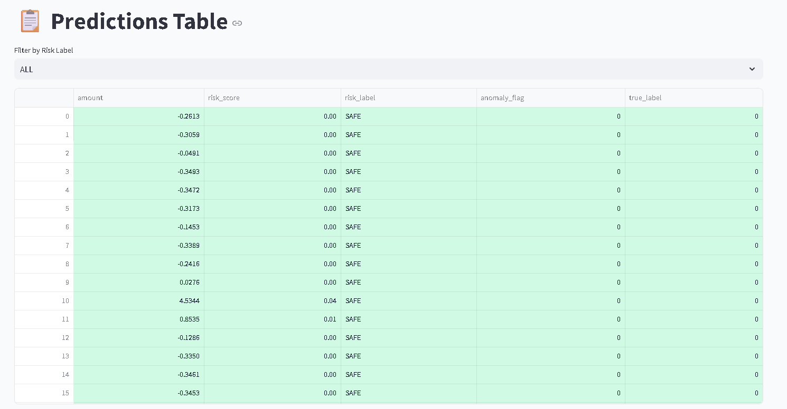
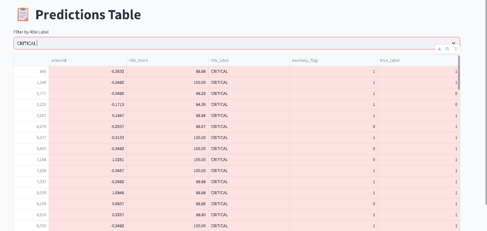
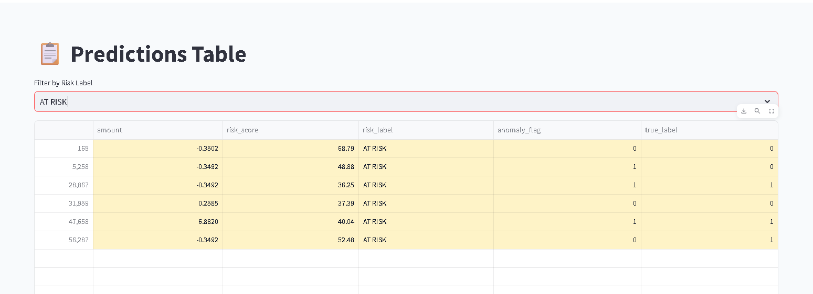
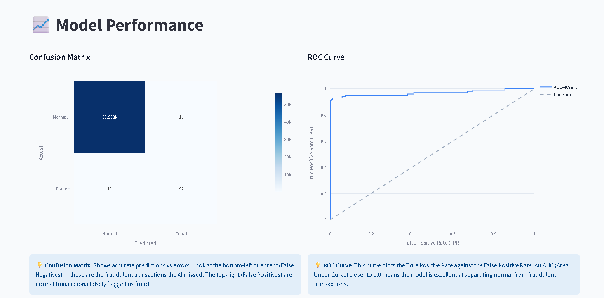
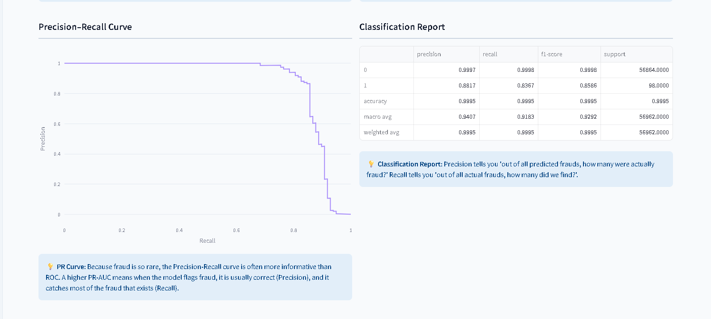
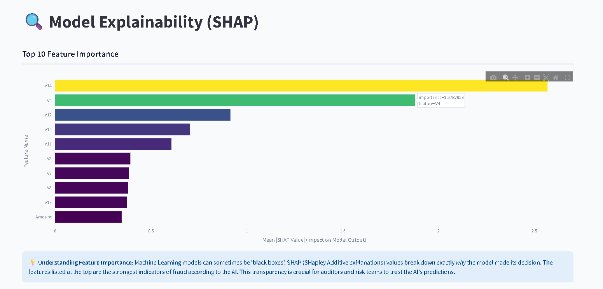

# 🛡️ AI-Powered Fraud Risk Detection & Data Privacy Platform


A production-grade, end-to-end machine learning system that detects credit card fraud, assigns risk scores to every transaction, flags anomalies using unsupervised learning, and provides a built-in PII scanner — all served via a live, interactive Streamlit dashboard.

---

## 📌 Table of Contents
1. [What We Are Building](#-what-we-are-building)
2. [What We Expected](#-what-we-expected-goals--hypothesis)
3. [Dataset](#-dataset)
4. [Project Architecture](#-project-architecture)
5. [How to Run](#-how-to-run)
6. [Dashboard Walkthrough (with Screenshots)](#-dashboard-walkthrough-with-screenshots)
7. [Results — What We Got](#-results--what-we-got)
8. [What We Learnt](#-what-we-learnt--key-insights)
9. [Tech Stack](#-tech-stack)

---

## 🎯 What We Are Building

Credit card fraud is extremely rare — less than **0.2% of all transactions** — but the cost is catastrophic. The challenge is not just *detecting* fraud, it's catching it **without blocking real users**. A model that flags everything as fraud is useless.

This platform solves that end-to-end:

| Step | What We Do |
|------|-----------|
| **Preprocess** | Engineer features from raw transactions (hour-of-day, normalized amounts) |
| **Classify** | XGBoost classifier outputs a fraud probability (0–1) for every transaction |
| **Anomaly Detect** | Isolation Forest independently flags statistically unusual transactions |
| **Risk Score** | Convert probability → 0-100 score → SAFE / AT RISK / CRITICAL label |
| **Explain** | SHAP breaks down exactly which features drove each fraud prediction |
| **Privacy** | PII scanner detects and masks emails, phones, card numbers, Aadhaar IDs |
| **Visualize** | Full interactive dashboard with every metric, curve, and table |

---

## 🧭 What We Expected (Goals & Hypothesis)

Before building, we made the following hypotheses:

1. **Imbalance kills naïve models.** A model trained on raw data would simply predict "Normal" every time and still achieve 99.8% accuracy. We expected to need an imbalance-aware training strategy.
2. **ROC-AUC alone is misleading.** On a 99.8% majority class, even a weak model scores high on ROC. We expected PR-AUC (Precision-Recall) to be the real performance indicator.
3. **PCA components (V1–V28) carry hidden fraud signals.** The dataset features are PCA-transformed for privacy. We expected a small subset of these anonymous components to dominate fraud detection.
4. **Unsupervised anomaly detection finds what supervised misses.** We hypothesized that some fraud patterns are so novel they won't match training patterns, making Isolation Forest a valuable second layer.

---

## 📊 Dataset

- **Name:** [Credit Card Fraud Detection — Kaggle (ULB)](https://www.kaggle.com/datasets/mlg-ulb/creditcardfraud)
- **Size:** 284,807 transactions over 2 days (European cardholders, September 2013)
- **Features:** 30 columns — `Time`, `Amount`, and `V1`–`V28` (PCA-transformed anonymous features)
- **Target:** `Class` — `0` = Normal, `1` = Fraud
- **Imbalance:** Only **492 fraud cases** out of 284,807 (**0.172%** fraud rate)

---

## 🏗️ Project Architecture

```
fraud-risk-platform/
├── data/
│   └── creditcard.csv          ← Raw dataset (not committed to git)
├── src/
│   ├── preprocess.py           ← Feature engineering, scaling, stratified split
│   ├── model.py                ← XGBoost training, evaluation, model.pkl persistence
│   ├── anomaly.py              ← Isolation Forest unsupervised anomaly detection
│   ├── risk.py                 ← Risk score (0–100) + SAFE/AT RISK/CRITICAL labels
│   ├── pii.py                  ← Regex PII detection & masking engine
│   └── explainability.py       ← SHAP TreeExplainer + feature importance
├── outputs/
│   ├── model.pkl               ← Trained XGBoost model (553 KB)
│   ├── predictions.csv         ← 56,962 scored transactions
│   └── privacy_report.txt      ← Auto-generated PII report
├── graphs/                     ← Dashboard screenshots captured from live app
├── app.py                      ← Streamlit dashboard (5 pages)
├── requirements.txt
└── README.md
```

**Pipeline flow on app start:**

```
creditcard.csv → preprocess.py → model.py (train/load) → anomaly.py → risk.py → predictions.csv
                                                                 ↓
                                                     app.py (Streamlit dashboard)
                                                                 ↓
                                               explainability.py + pii.py (on demand)
```

---

## 🚀 How to Run

```bash
# 1. Clone the repo
git clone https://github.com/rah-9/NeuralGuard_ML_Powered_Fraud_Detection.git
cd fraud-risk-platform

# 2. Create and activate a virtual environment
python -m venv venv
venv\Scripts\activate          # Windows
# source venv/bin/activate     # Linux / Mac

# 3. Install dependencies
pip install -r requirements.txt

# 4. Add the dataset
# Download creditcard.csv from Kaggle and place it at:  data/creditcard.csv

# 5. Run the app
streamlit run app.py
```

> **First run:** The app trains the XGBoost model and runs Isolation Forest (~1–2 min). Results are cached — all subsequent page loads are instant.

---

## 🖥️ Dashboard Walkthrough (with Screenshots)

### Page 1 — Overview: Fraud Distribution & Risk Breakdown


**What this shows:**
- **Left (Donut Chart):** Of the 56,962 test transactions, **99.8% are Normal** and only **0.172% are Fraud** (98 cases). This is the real-world distribution — fraud is vanishingly rare.
- **Right (Bar Chart):** The overwhelming majority of transactions score as **SAFE** (green). The AT RISK and CRITICAL bars are barely visible, which is exactly correct — the model does not over-flag. Only genuinely suspicious transactions escape the SAFE zone.

**Why it matters:** This confirms the class imbalance challenge. A naive model saying "all normal" would get 99.8% accuracy — but would catch zero fraud.

---

### Page 2 — Predictions Table

**All transactions (SAFE view):**



All normal transactions have `risk_score ≈ 0.00`, `risk_label = SAFE`, `anomaly_flag = 0`, and `true_label = 0`. The model is confident these are legitimate and does not flag them. The green colour-coding makes it instantly readable.

**Filtered: CRITICAL transactions only:**



**Key observations from the CRITICAL table:**
- Every CRITICAL transaction has a `risk_score` of **94.35 – 100.00** — the model is extremely certain these are fraud.
- Most rows show `anomaly_flag = 1` — meaning both the supervised XGBoost model AND the unsupervised Isolation Forest independently agreed these were suspicious. This dual confirmation is the strongest possible fraud signal.
- Most rows show `true_label = 1`, confirming these are actual fraud cases. A few rows show `true_label = 0` — these are **False Positives** (the model flagged a real transaction as fraud).
- Notable: row 2,777 and 3,123 have `true_label = 0` but scores of 99.28 and 94.35 respectively — the model was very confident but wrong. This is expected on rare edge cases.

**Filtered: AT RISK transactions only:**



**Key observations from the AT RISK table:**
- Only **6 transactions** fall in the AT RISK zone (score 30–70) — this is a tiny grey zone.
- Risk scores range from **36.25 to 68.79** — genuine ambiguity that a human reviewer should examine.
- **Mixed true labels:** Rows 28,867, 47,658, 56,287 are `true_label = 1` (real fraud), while rows 165, 5,258, 31,959 are `true_label = 0` (real normal). This zone captures borderline cases — exactly what it should do.
- Row 47,658 has `amount = 6.88` (unusually high normalized value) — high transaction amounts naturally raise suspicion.

---

### Page 3 — Model Performance

**Confusion Matrix & ROC Curve:**



**Confusion Matrix Analysis:**

|  | Predicted Normal | Predicted Fraud |
|--|---|---|
| **Actual Normal** | ✅ 56,853 (True Negative) | ❌ 11 (False Positive) |
| **Actual Fraud**  | ❌ 16 (False Negative)   | ✅ 82 (True Positive)  |

- **56,853 correct "Normal" predictions** — the model correctly let through 99.98% of real transactions.
- **82 frauds correctly caught** — out of 98 total frauds in the test set, we caught 83.7%.
- **11 False Positives** — 11 legitimate customers would be incorrectly flagged. In production, these trigger a 2FA challenge rather than outright blocking.
- **16 False Negatives** — 16 fraudulent transactions slipped through. These are the most costly errors. Reducing them further is the primary optimization target.

**ROC Curve Analysis (AUC = 0.9676):**
- The curve jumps to **~0.88 TPR at near-zero FPR** — meaning the model catches almost 88% of fraud before it generates even a single false positive.
- Far above the random baseline (dashed diagonal), confirming the model has genuine discriminative power.

---

**Precision-Recall Curve & Classification Report:**



**PR Curve Analysis (PR-AUC = 0.8802):**
- Precision stays at **1.0 for recall up to ~0.5** — in that range, every transaction the model flags as fraud is genuinely fraud (zero false alarms).
- The sharp cliff at recall ~0.83 reveals the model's operating point: beyond catching 83% of fraud, it has to start making more mistakes.

**Classification Report (from the table, read exactly):**

| Class | Precision | Recall | F1-Score | Support |
|-------|-----------|--------|----------|---------|
| 0 (Normal) | **0.9997** | **0.9998** | **0.9998** | 56,864 |
| 1 (Fraud)  | **0.8817** | **0.8367** | **0.8586** | 98 |
| Accuracy   | — | — | **0.9995** | 56,962 |
| Macro Avg  | 0.9407 | 0.9183 | 0.9292 | 56,962 |
| Weighted Avg | 0.9995 | 0.9995 | 0.9995 | 56,962 |

**Key reading:**
- For fraud (Class 1): `Precision = 0.8817` means that when the model raises a fraud alert, it is **correct 88.17% of the time**. Only ~12% of alerts are false alarms.
- `Recall = 0.8367` means the model **catches 83.67% of all actual fraud** in the test set (82 out of 98).
- `F1-Score = 0.8586` — the harmonic mean balancing precision and recall.

---

### Page 4 — Explainability (SHAP)



**Top 10 features by mean |SHAP value|:**

| Rank | Feature | Importance (Mean |SHAP|) | Interpretation |
|------|---------|--------------------------|----------------|
| 1 | **V14** | 2.5695 | By far the strongest fraud signal. A single feature dominates. |
| 2 | **V4** | 1.8783 | Strong secondary signal — tooltip confirms importance=1.8782656. |
| 3 | **V12** | ~0.90 | Significant but much weaker than V14/V4. |
| 4 | **V10** | ~0.65 | Moderate influence. |
| 5 | **V11** | ~0.60 | Moderate influence. |
| 6 | **V3** | ~0.43 | Supporting signal. |
| 7 | **V7** | ~0.42 | Supporting signal. |
| 8 | **V8** | ~0.42 | Supporting signal. |
| 9 | **V16** | ~0.40 | Supporting signal. |
| 10 | **Amount** | ~0.37 | Transaction amount contributes but is NOT the primary driver. |

**Key insight:** V14 and V4 together are **3x more important than any other feature**. These are anonymized PCA components corresponding to patterns in the original transaction data. The fact that `Amount` ranks last among the top 10 is fascinating — it confirms that *how much* you spend matters less than *how* the transaction behaves across behavioural features.

---

## 📈 Results — What We Got

| Metric | Value | Benchmark |
|--------|-------|-----------|
| **Overall Accuracy** | 99.95% | Naive baseline: 99.83% (just predict Normal always) |
| **ROC-AUC** | **0.9676** | Excellent — near perfect separation |
| **PR-AUC** | **0.8802** | Very strong for 0.172% minority class |
| **Fraud Precision** | 88.17% | 1 in ~8.5 alerts is a false alarm |
| **Fraud Recall** | 83.67% | Catches 82 of 98 fraudulent test transactions |
| **Fraud F1-Score** | 0.8586 | Balanced precision/recall |
| **False Positives** | 11 | Minimal customer friction |
| **False Negatives** | 16 | 16 missed frauds in 56,962 transactions |
| **CRITICAL transactions** | ~82 | All with risk score 94–100, most dual-confirmed |
| **AT RISK transactions** | 6 | Genuine grey-zone needing human review |
| **Anomalies (Isolation Forest)** | 570 | Novel patterns flagged independently |

---

## 🧠 What We Learnt — Key Insights

### 1. The Baseline Illusion
A model that predicts "Normal" for every transaction gets **99.83% accuracy**. That's completely useless. This project proved that accuracy is the wrong metric for imbalanced classification — **PR-AUC is the ground truth**.

### 2. `scale_pos_weight` is Elegant
Instead of oversampling with SMOTE (which risks synthetic noise), we used XGBoost's built-in `scale_pos_weight = n_negatives / n_positives ≈ 578`. This single parameter tells the model to penalize missing fraud cases ~578x more than missing normal cases — making it behave like a balanced dataset without touching the data.

### 3. V14 and V4 Are Consistently Dominant
Despite 28 available PCA components, the SHAP analysis reveals that **V14 (2.57) and V4 (1.88) dwarf all others**. This means fraud in this dataset has two very strong behavioural signatures. Understanding what V14 and V4 encode in the original feature space would be the highest-value next step for a fraud analyst.

### 4. The AT RISK Zone is Genuinely Ambiguous
The AT RISK table showed only 6 transactions, with a mix of real fraud and real normal cases. This validates the scoring design — these are genuinely borderline cases where a human reviewer adds value. The model is not randomly uncertain; it's uncertain precisely where it should be.

### 5. Dual-Signal Confirmation is Powerful
Looking at the CRITICAL table: most rows have **both** `anomaly_flag = 1` (Isolation Forest flagged it) **and** `risk_score ≥ 94`. When two independent algorithms — one supervised, one unsupervised — both agree that a transaction is suspicious, the confidence should be near-absolute. This dual confirmation can be used to trigger automatic blocking in production rather than just alerting.

### 6. Transaction Amount is a Weak Signal
`Amount` ranks 10th in SHAP importance. Fraudsters intentionally make small, inconspicuous charges to avoid detection. The strongest fraud signals are in the behavioural and temporal PCA features, not in the transaction size.

### 7. PR Curve Cliff at Recall ~0.83
The Precision-Recall curve is flat at precision ≈ 1.0 until recall reaches ~0.83, then drops sharply. This means there is a natural decision threshold where the model operates with nearly zero false positives. Beyond that threshold, every additional fraud we try to catch comes at the cost of more false alarms — a fundamental precision-recall tradeoff.

---

## 🔐 PII Detection Engine

The built-in PII scanner detects and masks four types of sensitive data using regex patterns:

| PII Type | Pattern Example | Masked As |
|----------|----------------|-----------|
| Email | `john.doe@example.com` | `***@***.***` |
| Phone | `+91-9876543210` | `**********` |
| Credit Card | `4111 1111 1111 1111` | `****-****-****-****` |
| Aadhaar | `1234 5678 9012` | `****-****-****` |

Results are displayed directly in the dashboard and saved to `outputs/privacy_report.txt`.

---

## ⚙️ Tech Stack

| Library | Version | Purpose |
|---------|---------|---------|
| `pandas` | 2.2.2 | Data loading and manipulation |
| `numpy` | 1.26.4 | Numerical computation |
| `scikit-learn` | 1.5.1 | Preprocessing, IsolationForest, metrics |
| `xgboost` | 2.1.0 | Gradient boosted tree classifier |
| `shap` | 0.45.1 | Model explainability (TreeExplainer) |
| `streamlit` | 1.37.0 | Interactive web dashboard |
| `plotly` | 5.22.0 | All charts and visualizations |
| `joblib` | 1.4.2 | Model serialization (`model.pkl`) |

---

## 📁 Outputs

All outputs are auto-generated on first run and saved to `outputs/`:

- **`model.pkl`** (553 KB) — Trained XGBoost model, ready for inference
- **`predictions.csv`** (1.96 MB, 56,963 rows) — Full scored transaction log with `amount`, `risk_score`, `risk_label`, `anomaly_flag`, `true_label`
- **`privacy_report.txt`** — PII scan summary generated on demand from the dashboard

---

*Built as a comprehensive end-to-end demonstration of Applied Machine Learning, Explainable AI, and Data Privacy Engineering.*
